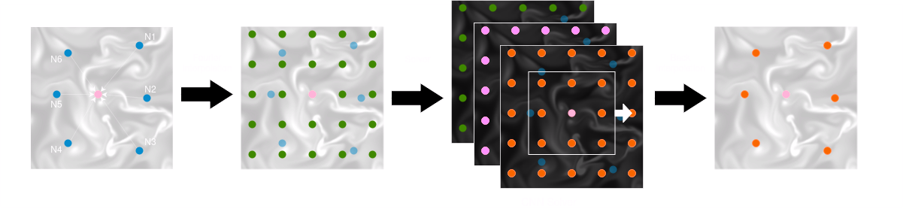

# GrIND: Grid Interpolation Network for Dynamical Systems

This is the repository containing the source code of the GrIND model paper __GrIND: Grid Interpolation Network for Scattered observation__.

GrIND is a novel deep learning architecture for learning from physical systems governed by differential equations. It can be used to smiulate sytsems such as climate, fluids, electormagnetic fields, etc..
The model is based on an ODE solving algorithm to approximate the future features of the nodes by interpolating between the arbitrarily located neighboring nodes.
Fourier interpolation leads to a grid structure which can be used with standard DE solving algorithms to find the feature tensor of the next time step.
A neural network is used to map the feature tensor to its derivatives.
The structure of the GrIND model is simplified in the following graphic.

The fourier layer is further visualised in the following graphic.
Originally, a low resolution function is represented at single nodes.
These are then interpolated to generate a more dense function which is better suited for the solving algorithm.

## Setup
It is recommended to first create a virtual environment, for example:

    python -m venv GrINDenv
    source GrINDenv/bin/activate

You can then install all dependencies by running 

    python pip install -r requirements.txt

from the main project directory

## Test
To test the model execute the main file

    python main.py

To configure the training process and the model, check the config files and adjust parameters to your liking.

## Benchmark Results
The model is tested on the dynabench dataset for learning dynamical systems from data __Dynabench: A benchmark dataset for learning dynamical systems from low-resolution data__ (accepted at ECML-PKDD 2023).

Here ares some results of our model on the given equations. More results and comparisons with similar models can be found in the paper.

| equation / time steps| 1          | 16         |
|----------------------|------------|------------|
| Advection            | 6.11e-3    | 1.03e-1    |
| Burgers              | 1.03e-2    | 2.24e-1    |
| Gas Dynamics         | 8.49e-2    | 5.40e-1    |
| Kuramoto-Sivashinsky | 1.23e-1    | 1.00e0     |
| Reaction-Diffusion   | 2.72e-2    | 2.95e-1    |
| Wave                 | 4.74e-2    | 3.12e-1    |